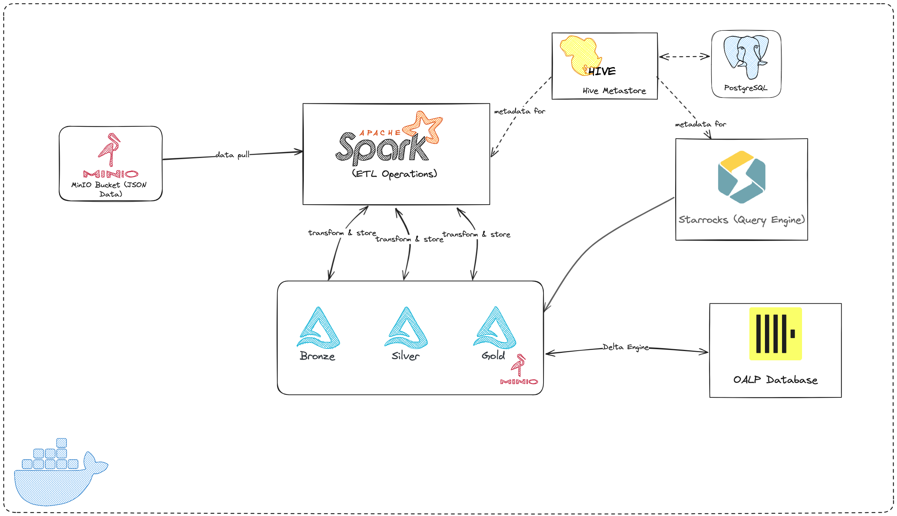

# SPARK BATCH ETL PIPELINE
**Data Pipeline Architecture Documentation**
 

    
   </a>

## Overview
This document provides a comprehensive overview of the data pipeline architecture, designed to ingest, process, and deliver data for a variety of analytical workloads. 
The pipeline leverages industry-leading technologies to ensure high performance, scalability, reliability, and flexibility, enabling insightful data-driven decision-making.

## Architecture Explanation
### Data Ingestion:
* JSON log files are initially stored in MinIO S3-compatible object-storage. 
* Apache Spark extracts the data from S3, initiating the ETL process. 

### Data Processing:
* **Spark** performs ETL operations, adhering to the Medallion architecture for robust data pipeline design.
* Data is transformed and stored in **Delta Lake** format, ensuring ACID transactions, schema evolution, and time travel capabilities. 
* Delta Lake _Compaction_ and _Z-Order_ are applied on data to speed up the ETL performance.

### Data Storage and Querying:
Processed data in Delta Lake format is accessible to multiple query engines for diverse analytical needs:
* **ClickHouse**: Serves as OALP database, load data in Delta Lake format directly using native Delta Engine, enables real-time analytics and low-latency queries.
* **StarRocks**: Serves as the primary query engine, providing high-performance OLAP capabilities for complex analytical queries.
  * **StarRocks Architecture**:
    * **Frontend (FE)** Node: Optimizes and plans query execution for efficient performance. 
    * **Backend (BE)** Node: Stores and manages data, executing queries to retrieve insights. 
    * **Broker** Node: Coordinates and manages FE and BE nodes, ensuring load balancing and seamless query routing.
  
### Metadata Management:
Hive Metastore serves as a centralized repository for metadata, enabling efficient management of table schemas, partitions, and data lineage.

### Key Features and Benefits
* **Scalability**: The pipeline architecture supports seamless growth and accommodates increasing data volumes.
* **Performance**: StarRocks and ClickHouse deliver exceptional query performance, empowering timely insights.
* **Reliability**: Delta Lake guarantees data integrity and resilience to failures, ensuring data trustworthiness.
* **Flexibility**: The pipeline supports multiple query engines, catering to diverse analytical requirements.
* **Manageability**: Hive Metastore simplifies metadata management, streamlining data governance and administration.