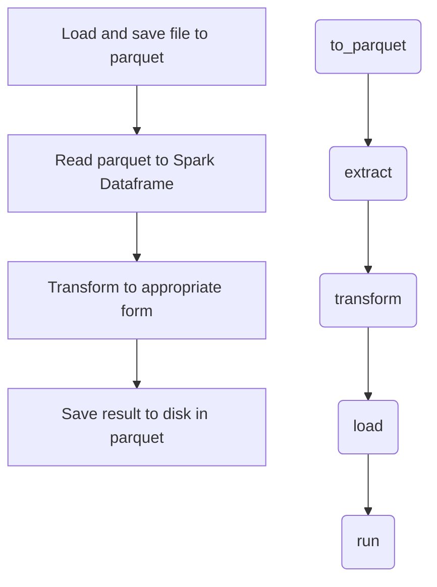

# Homework 4
## Introduction
Hi, thanks for reading my homework 4 folder. In homework 4, **Long** asked us to refactor provided `ETL_scripts.py`. Moreover, we also need to
refactor 2 methods:
- **Method 1**: ETL one file at a time then concatenate them together.
- **Method 2**: ETL one big table.

## My implementation
Though, I decided to fix and re-implement my own **HW2** script to meet the requirements. Instead of a script having several functions,
I refactored my script with **Factory Pattern** in order to learn some best *practices in data pipeline design patterns* (kinds of...). You can
find my implementation in `Hw4_refactor.py`.

That being said, it is worth noticing that I rely heavily on **parquet file format** since **parquet** has superior performance over **json** in 
analytical workload. Generally, my workload is:

Here, I also explain `Hw4_refactor.py` in short followings these steps:

1. The file defines a function called `build_spark` that builds and configures a Spark session with specific settings. It returns the configured Spark session.

2. The file also defines a class called `StandardETL` which is an abstract base class (ABC). It has an initializer method (__init__) that takes several optional parameters for storage paths, file paths, and save paths.
The initializer sets default values for these parameters and also checks if certain paths exist, raising a FileNotFoundError if they don't.

3. The `StandardETL` class has several methods defined, such as `to_parquet, extract, transform, load, and run`. These methods are meant to be implemented by subclasses of StandardETL.

4. There is another class called `LogETL `that extends` StandardETL` and **overrides** the `load` and `extract` methods. 
These methods provide functionality specific to log data extraction and loading.

## Why?
You may ask why I opt to do this direction. Well, it is mostly due to the homework in which we have to refactor 2 different methods but same result. 
I realized that these two shared **a similar ETL pattern plus some specific properties**. Thus, this is a decent opportunity to use **Factory Pattern**
which contains a common method or abstract interfaces `StandardETL` class and two methods will be a concrete implementation of `StandardETL`.

## Update
Until now, I have completed refactored **method 2**.
